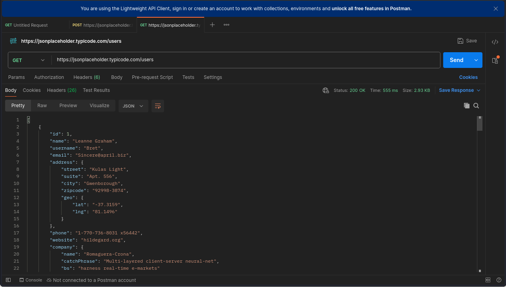
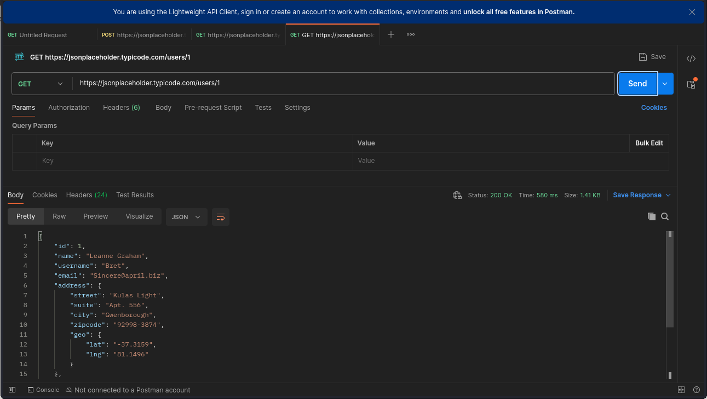
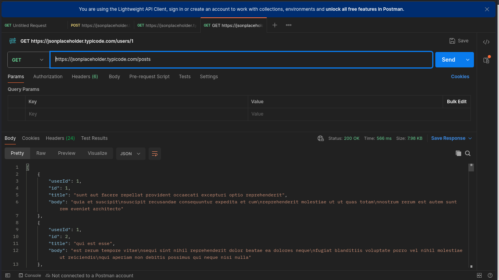
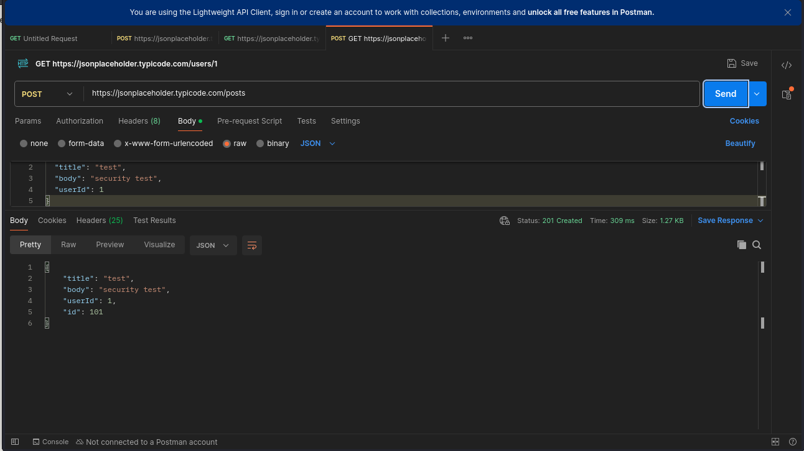

# API Security Risk Analysis — jsonplaceholder.typicode.com

**Intern:** Hodome Kokou Achille  
**Program:** Future Interns — Cyber Security Fellowship  
**CIN:** FIT/MAR26/CS6617  
**Date:** March 2026  
**Task:** Task 3 — API Security Risk Analysis  

---

## 1. Introduction

For this task, I analyzed the security posture of a public REST API using Postman. The target was `jsonplaceholder.typicode.com`, a publicly available fake API commonly used for testing and prototyping. While it is not a production system, it exhibits several security weaknesses that would be critical in a real-world context.

The analysis focused on four areas: authentication, data exposure, access control, and input handling.

**Tools used:**
- Postman (API testing)
- Browser DevTools (header inspection)

---

## 2. Findings

---

### Finding 1 — Unauthenticated Access to User Data

**Endpoint:** `GET /users`  
**Risk: High**



Sending a simple GET request to `/users` returns the full profile of all 10 users in the system — with zero authentication required. Each record includes the user's full name, username, email address, physical address, GPS coordinates, phone number, personal website, and company details.

In a real application, this level of data exposure without any access control would be a serious violation of basic privacy principles and potentially of data protection regulations. An attacker could harvest this data with a single request and use it for targeted attacks, phishing, or identity theft.

---

### Finding 2 — Direct Object Access Without Authorization

**Endpoint:** `GET /users/1`  
**Risk: High**



Individual user records are accessible by simply changing the ID in the URL — no token, no session, no verification. This is a textbook case of Insecure Direct Object Reference (IDOR). An attacker can enumerate all user profiles by iterating through IDs starting from 1.

In a production API, each user should only be able to access their own profile, and any attempt to access another user's data should return a 403 Forbidden response.

---

### Finding 3 — Unauthenticated Access to All Posts

**Endpoint:** `GET /posts`  
**Risk: Medium**



The `/posts` endpoint returns all 100 posts from all users without requiring any form of authentication. Depending on the application, posts could contain sensitive or private content that should only be visible to the author or authorized users.

Combined with Finding 2, an attacker can easily cross-reference user IDs to map which posts belong to which user, building a complete picture of user activity.

---

### Finding 4 — Unauthenticated Write Operations

**Endpoint:** `POST /posts`  
**Risk: High**



The API accepted a POST request to create a new resource without any authentication whatsoever. The request returned a 201 Created response with the new resource ID.
```json
{
    "title": "test",
    "body": "security test",
    "userId": 1,
    "id": 101
}
```

In a real system, allowing unauthenticated write operations means anyone on the internet can create, and potentially modify or delete, data on behalf of any user. This completely breaks the integrity of the application.

---

## 3. Summary

| # | Endpoint | Issue | Risk |
|---|---|---|---|
| 1 | GET /users | Full user data exposed without auth | High |
| 2 | GET /users/1 | IDOR — direct object access by ID | High |
| 3 | GET /posts | All content accessible without auth | Medium |
| 4 | POST /posts | Write operations without authentication | High |

---

## 4. Recommendations

**Implement authentication on all endpoints.** Every request to a protected resource should require a valid token — JWT or OAuth2 are the standard approaches for REST APIs. Without this, the API has no way of knowing who is making a request.

**Apply proper authorization checks.** Authentication alone is not enough. Even authenticated users should only be able to access resources they own. A request to `/users/2` from user 1 should return 403, not the full profile of user 2.

**Limit data returned by each endpoint.** The `/users` endpoint returns far more information than most use cases require. API responses should follow the principle of minimum necessary data — return only what the client actually needs.

**Require authentication for all write operations.** POST, PUT, PATCH, and DELETE requests should never be accepted without verifying the identity and permissions of the requester.

**Add rate limiting.** None of the endpoints tested showed any rate limiting behavior. Without it, an attacker can enumerate all users and posts in seconds with an automated script.

---

## 5. Conclusion

The API tested exposes significant security gaps that would be unacceptable in a production environment. Three of the four findings are rated High, all stemming from the same root cause: the complete absence of authentication and access control.

The fixes are well-established and not technically complex — implementing JWT-based authentication and basic authorization checks would address the majority of the issues identified here.

---


*Target: jsonplaceholder.typicode.com (public test API)*  
